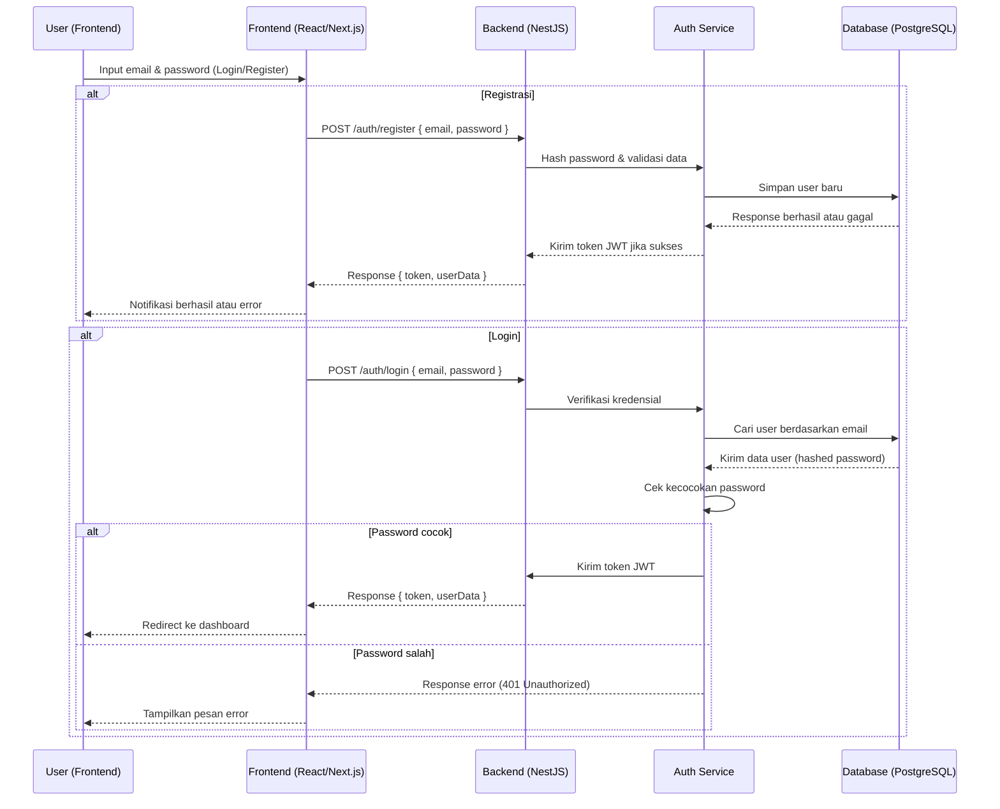
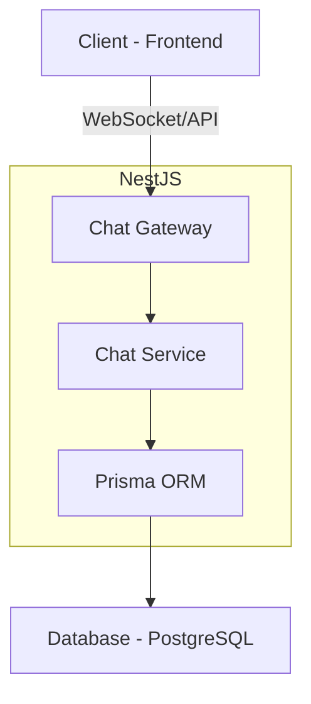

# Chat Application - Backend (NestJS)

## Struktur Folder

### 1. **prisma/**
   - `schema.prisma`: Skema database yang digunakan oleh Prisma ORM.
   - `prisma.module.ts`: Modul Prisma untuk menghubungkan database dengan NestJS.
   - `prisma.service.ts`: Service Prisma untuk mengelola koneksi dan query database.

### 2. **src/** (Kode utama backend)
#### a. **chat/**
   - `chat.gateway.ts`: Mengatur komunikasi real-time menggunakan WebSocket.
   - `chat.module.ts`: Modul utama yang menggabungkan layanan chat.
   - `chat.service.ts`: Logika bisnis terkait chat (misalnya menyimpan dan mengambil pesan).
   - `chat.gateway.spec.ts & chat.service.spec.ts`: File untuk unit testing fitur chat.

#### b. **dto/** (Data Transfer Objects)
   - `create-mahasiswa.dto.ts`: DTO untuk membuat mahasiswa baru.
   - `login-user.dto.ts`: DTO untuk autentikasi pengguna.
   - `register-user.dto.ts`: DTO untuk registrasi pengguna baru.
   - `update-mahasiswa.dto.ts`: DTO untuk memperbarui data mahasiswa.

#### c. **entity/**
   - `user.entity.ts`: Struktur data pengguna yang akan digunakan dalam database.

#### d. **profile/**
   - `profile.controller.ts`: Endpoint API untuk mengelola profil pengguna.
   - `profile.module.ts`: Modul utama untuk fitur profil.
   - `profile.service.ts`: Logika bisnis terkait profil pengguna.
   - `profile.controller.spec.ts & profile.service.spec.ts`: Unit testing untuk fitur profil.

#### e. **auth/** (Autentikasi)
   - `auth.controller.ts`: Endpoint API untuk login dan registrasi.
   - `auth.module.ts`: Modul utama untuk fitur autentikasi.
   - `auth.service.ts`: Logika bisnis untuk autentikasi pengguna.
   - `auth.guard.ts`: Middleware untuk melindungi endpoint API yang membutuhkan autentikasi.

#### f. **Lainnya**
   - `app.controller.ts`: Controller utama aplikasi.
   - `app.module.ts`: Modul utama yang menggabungkan seluruh fitur.
   - `app.service.ts`: Service utama aplikasi.
   - `main.ts`: Entry point untuk menjalankan aplikasi NestJS.

### 3. **uploads/**
   - Menyimpan file yang diunggah oleh pengguna.

### 4. **test/**
   - Berisi file pengujian aplikasi.

### 5. **Konfigurasi dan Dependensi**
   - `.env`: File konfigurasi environment (misalnya database URL, secret key JWT).
   - `.eslint.js & .prettierrc`: Konfigurasi linting dan formatting kode.
   - `nest-cli.json`: Konfigurasi untuk NestJS CLI.
   - `package.json`: Daftar dependensi dan skrip npm.
   - `tsconfig.json & tsconfig.build.json`: Konfigurasi TypeScript.

## Diagram Alur Proses Login & Registrasi



## Diagram Hubungan Antar Komponen




## Cara Menjalankan Aplikasi

1. Install dependensi:
   ```bash
   npm install
   ```
2. Jalankan database Prisma:
   ```bash
   npx prisma migrate dev
   ```
3. Jalankan aplikasi:
   ```bash
   npm run start
   ```
4. Akses API di:
   ```
   http://localhost:3000
   ```

